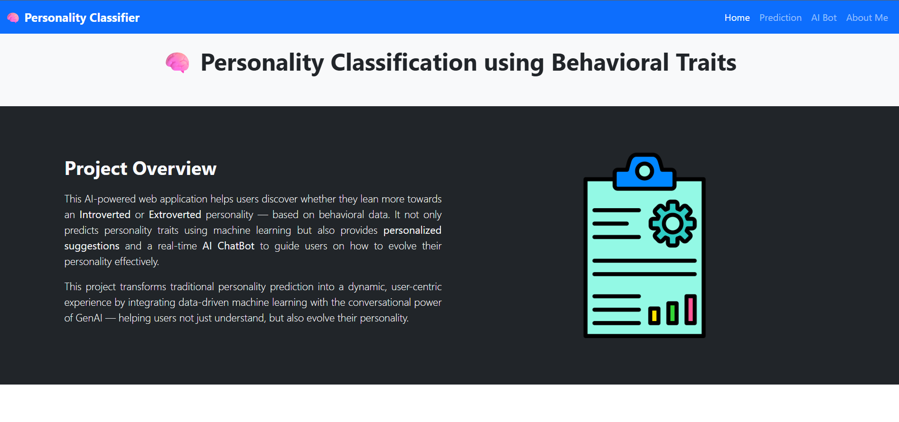
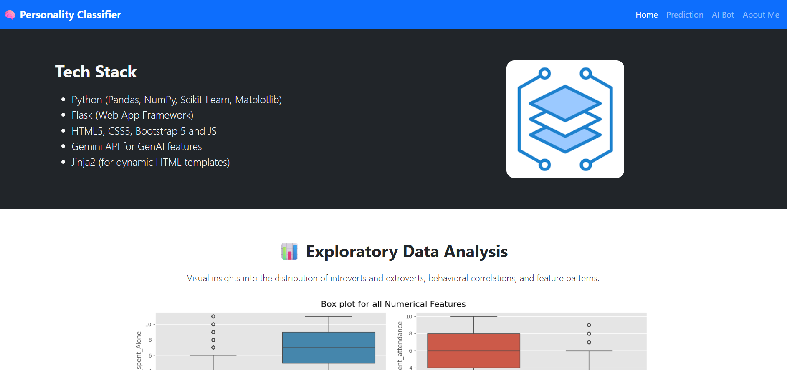
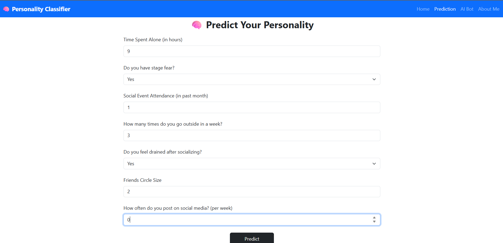
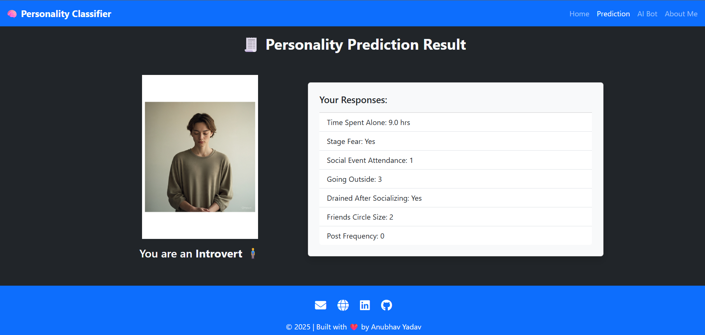
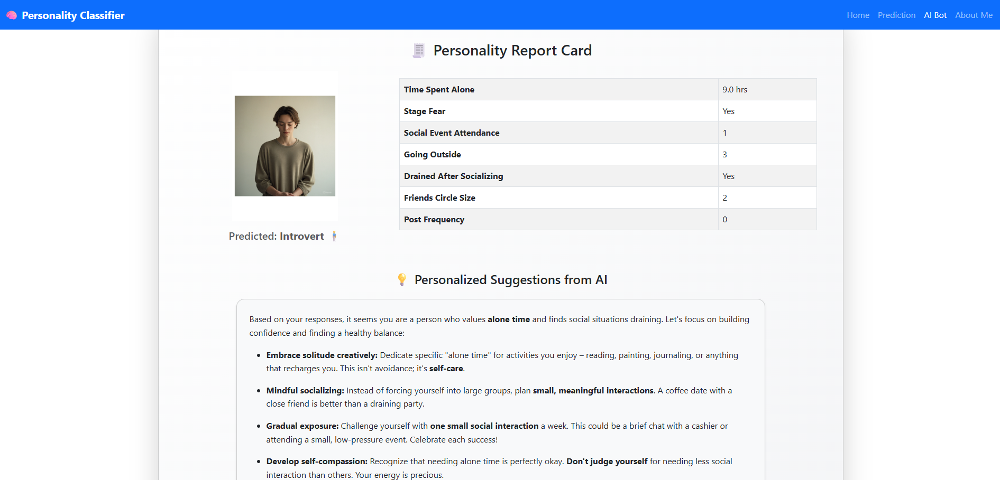
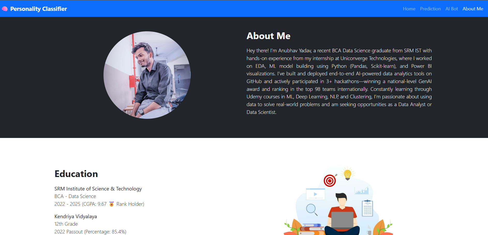

# Introvert vs Extrovert Classification Project

A hybrid AI web application that combines machine learning and conversational AI to predict personality types and offer personalized guidance.

---

## 🚀 Live Demo

Try it out at: [https://personality-classifier-cpud.onrender.com/](https://personality-classifier-cpud.onrender.com/)

---

## 🎯 Project Highlights

### What it does

- Predicts if a user is **Introvert** or **Extrovert** using behavioral traits.
- Provides a **dynamic report** with personalized insights and suggestions.
- Offers a **real-time AI ChatBot** equipped with personality context.
- Allows users to **download their report as a styled PDF**.

### Why it's special

- Blends **statistical ML** with **GenAI-powered conversation**.
- Personalized, empathetic support rather than flat predictions.
- Scalable web app using **Flask**, hosted on **Render**.

---

## 🛠 Tech Stack

| Component         | Tools & Libraries                                                                 |
|------------------|------------------------------------------------------------------------------------|
| Backend & ML      | Python, Flask, pandas, scikit-learn, sklearn Pipeline                           |
| AI & LLM         | Gemini GenAI API                                                                   |
| Frontend         | HTML5, CSS3, Bootstrap 5, JavaScript                                              |
| Deployment        | Render (Hosted web service)                                                       |

---

## 📁 Project Structure

```bash
/
├── app.py                # Main Flask application
├── src/
│   └── pipeline/
│       ├── predict_pipeline.py  # ML pipeline for loading model & preprocessor
│       └── utils.py      # Helper functions
├── artifacts/
│   ├── model.pkl         # Trained GradientBoosting model
│   └── preprocessor.pkl  # One-hot encoder + scaler pipeline
├── static/
│   ├── css/style.css     # Custom styles
│   ├── images/           # Images used in UI
├── templates/
│   ├── base.html
│   ├── index.html
│   ├── predict.html
│   ├── result.html
│   └── genai.html        # Personality report + AI chatbot
├── requirements.txt      # Project dependencies
├── start.sh              # Launch script using Gunicorn
└── README.md
```
---

## Installation & Setup

### 1. Clone the repository
```bash
git clone https://github.com/AnubhavYadavBCA25/Introvert-vs-Extrovert-Classification-Project.git
cd Introvert-vs-Extrovert-Classification-Project
```

### 2. Create virtual environment & install packages
```bash
python3 -m venv venv
source venv/bin/activate       # Linux/macOS
# .\venv\Scripts\activate      # Windows
pip install -r requirements.txt
```

### 3. Set environment variables
```bash
GEMINI_API_KEY=<your_gemini_api_key_here>
```

### 4. Run locally
```bash
# For development use
flask run

# Or production-like setup
./start.sh
```
---

## How It Works
1. User enters behavioral traits.
2. Flask loads ML model & preprocessor to predict personality.
3. Recommendations are generated using Gemini GenAI.
4. Results displayed in user-friendly format.
5. Option to download a PDF report. (Still in development)
6. The ChatBot continues the conversation with memory of user type.

---

## Web App UI


*Figure: Home Page*


*Figure: Prediction Page*


*Figure: Result Page*


*Figure: GenAI Report Page*


*Figure: About Me Page*

## About
Created by Anubhav Yadav – passionate about blending data and AI for meaningful user experiences.
Say hi: [GitHub](https://github.com/AnubhavYadavBCA25)

---

## License
This project is open-source and available under the [MIT License](LICENSE)


